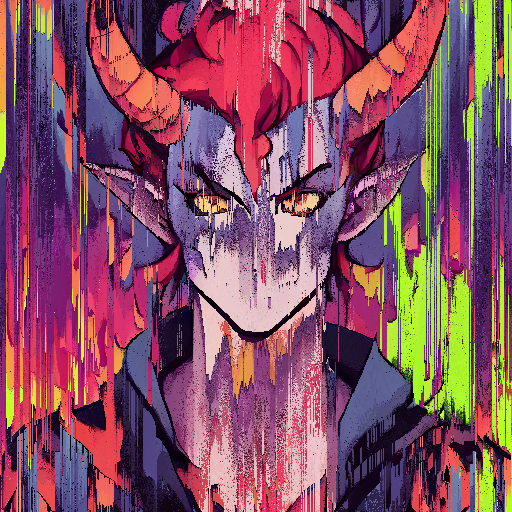

# glitch

Experimental implementations of some destructive image effects in Python

## Requirements

Those alGoRitHms are designed to work with Pillow.  
Have a look at [requirements.txt](./requirements.txt)

## Examples

### pixel_sort

 

Code: [examples/pixel_sort/run.py](./examples/pixel_sort/run.py)

### pixel_smear

 

Code: [examples/pixel_smear/run.py](./examples/pixel_smear/run.py)

### channel_offset

 

Code: [examples/channel_offset/run.py](./examples/channel_offset/run.py)

### led_screen

 

Code: [examples/led_screen/run.py](./examples/led_screen/run.py)
